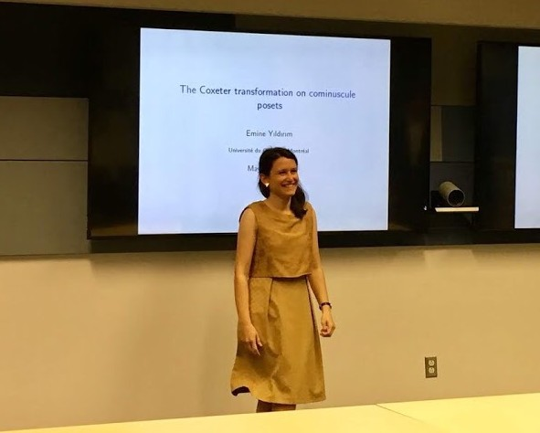

[[Home]](https://emine-yildirim.github.io/) [[Research]](https://emine-yildirim.github.io/Research.html) [[Blog]](http://yildirimemine.tumblr.com/)

Hi! I am a Coleman Research Fellow at the [Math Department](https://www.queensu.ca/mathstat/home) of [Queen's University](https://www.queensu.ca). I completed my PhD at the [LACIM](http://lacim.uqam.ca/) lab with [Hugh Thomas](http://www.math.uqam.ca/une_page.php?id=72).
