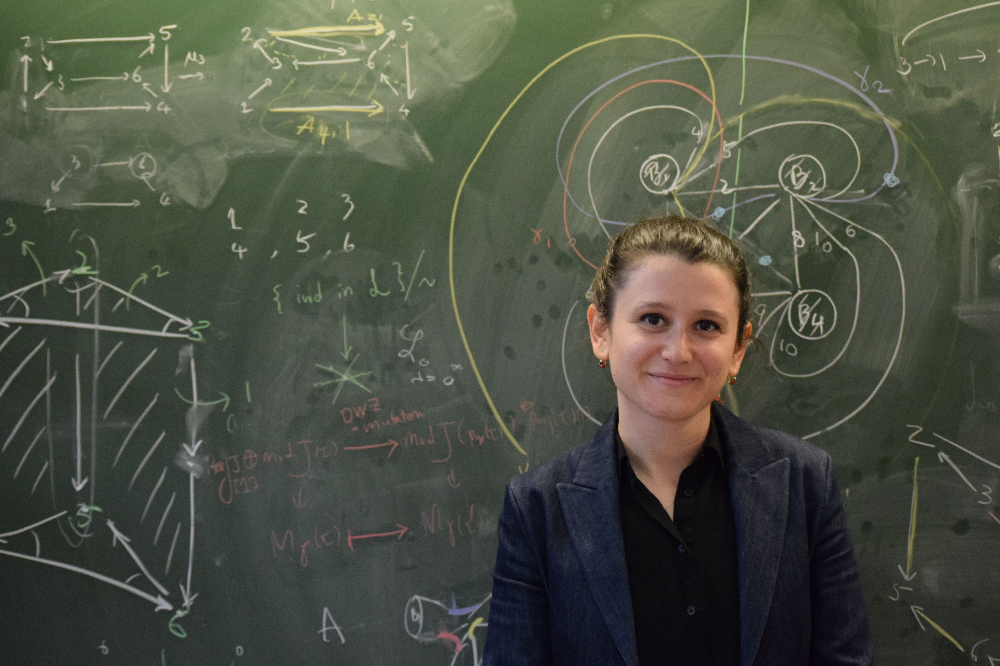

[[Home]](https://emine-yildirim.github.io/) 
[[Research]](https://emine-yildirim.github.io/Research.html) 
[[Teaching]](https://emine-yildirim.github.io/teaching.html)
[[Leeds Algebra Seminar]](https://emine-yildirim.github.io/Leeds_Seminars_2023-24.html)
[[Blog]](http://yildirimemine.tumblr.com/)

[Photo Credit: Dan Aspel]

Hi! I am currently a postdoctoral researcher in the [School of Mathematics](https://eps.leeds.ac.uk/maths) at the University of Leeds, working with [Karin Baur](https://www1.maths.leeds.ac.uk/~pmtkb/).

I completed my PhD at the [LACIM](http://lacim.uqam.ca/) with [Hugh Thomas](https://lacim.uqam.ca/membres-reguliers/) in 2018. I was an [INI](https://www.newton.ac.uk)-Simons Postdoctoral Research Fellow at the [DPMMS](https://www.dpmms.cam.ac.uk/), University of Cambridge in 2021. Here is a [link](https://www.newton.ac.uk/media/podcasts/post/meet-the-simons-postdoctoral-fellows-mini-series-1-dr-emine-yildirim/) to an episode of Living Proof podcast with Dan Aspel about being in INI/Cambridge as an early career researcher. Before Cambridge, I was a Coleman Research Fellow at the [Department of Mathematics and Statistics](https://www.queensu.ca/mathstat/), Queen's University. 

I am one of the organisers of the [ARTA IX](https://sites.google.com/view/arta9/home) to be held at Queen's University in 2023. I was one of the organizers of the [Virtual Advances in Representation Theory of Algebras 2021](https://sites.google.com/view/arta2021/) and I co-organized a [seminar series](https://www.newton.ac.uk/event/car/) at the Isaac Newton Institute under the Cluster algebras and representation theory (CAR) program.

Merhaba! Depremden etkilenen üniversite öğrencilerimize destek programına lütfen göz atın: [Matematik Dayanışma Platformu](https://sites.google.com/view/matematikdayanisma)
