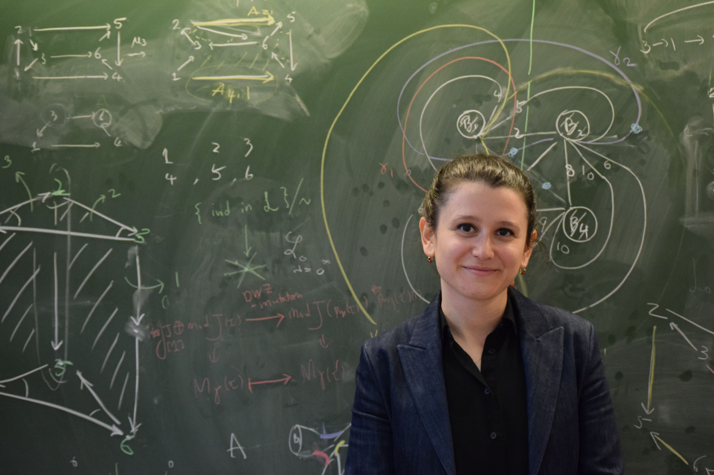

[[Home]](https://emine-yildirim.github.io/) 
[[Research]](https://emine-yildirim.github.io/Research.html) 
[[Teaching]](https://emine-yildirim.github.io/teaching.html)
[[Blog]](http://yildirimemine.tumblr.com/)

[Photo Credit: Dan Aspel]

Hi! I am an Asst. Prof. in [Galatasaray Üniversitesi](https://matematik.gsu.edu.tr/tr/hakkimizda/bolum-hakkinda#). 

I completed my PhD at the [LACIM](http://lacim.uqam.ca/) with [Hugh Thomas](https://uqam.academia.edu/HughThomas) in 2018. 

A list of my previous experiences:

- a researcher in  [the Quantum Groups and Cluster Algebras group](https://icms.bg/research-groups/quantum-groups-and-cluster-algebras/) at [the International Center for Mathematical Sciences (ICMS) - Sofia](https://icms.bg/).
- a research fellow in the [School of Mathematics](https://eps.leeds.ac.uk/maths) at the University of Leeds.
- an [INI](https://www.newton.ac.uk)-Simons Postdoctoral Research Fellow at the [DPMMS](https://www.dpmms.cam.ac.uk/), University of Cambridge. 
- a Coleman Research Fellow at the [Department of Mathematics and Statistics](https://www.queensu.ca/mathstat/), Queen's University.
  

NEWS:

An [article](https://ems.press/content/serial-article-files/52980) I wrote for European Mathematical Society Magazine ("The Math Solidarity Platform." Eur. Math. Soc. Mag. 139 (2026), pp. 13–14. DOI 10.4171/MAG/299.)

Here is a [link](https://www.newton.ac.uk/media/podcasts/post/meet-the-simons-postdoctoral-fellows-mini-series-1-dr-emine-yildirim/) to an episode of Living Proof podcast with Dan Aspel about being in INI/Cambridge as an early career researcher. 
