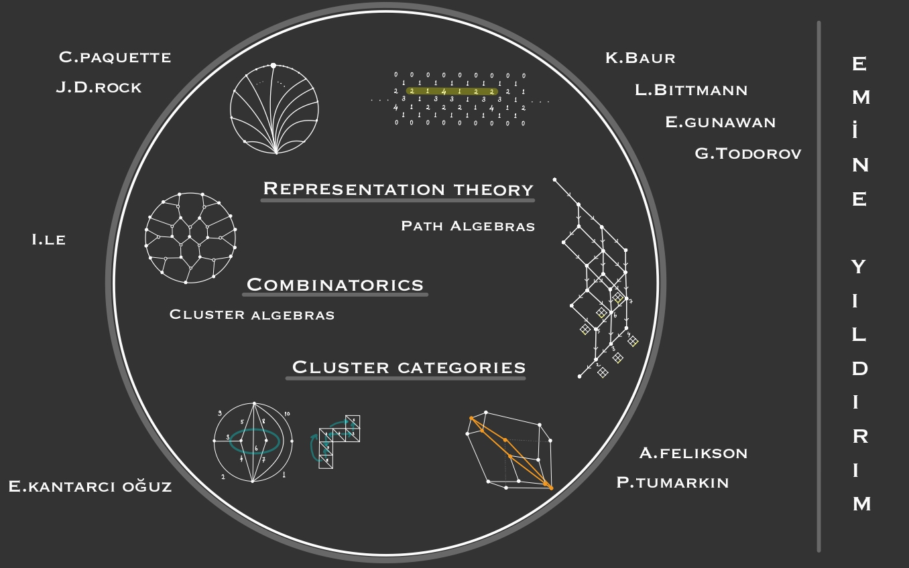

[[Home]](https://emine-yildirim.github.io/) 
[[Research]](https://emine-yildirim.github.io/Research.html) 
[[Teaching]](https://emine-yildirim.github.io/teaching.html)
[[Leeds Algebra Seminar]](https://emine-yildirim.github.io/Leeds_Seminars_2023-24.html)
[[Blog]](http://yildirimemine.tumblr.com/)

# Emine's Research Page

I am interested in representation theory of algebras, cluster algebras, their categorifications, and related combinatorics. Here is my [CV](Documents/Yildirim_CV.pdf). Below is a list of my papers and here is the link to the [ArXiv](https://arxiv.org/search/advanced?advanced=&terms-0-operator=AND&terms-0-term=Y%C4%B1ld%C4%B1r%C4%B1m%2C+Emine&terms-0-field=author&classification-mathematics=y&classification-physics_archives=all&classification-include_cross_list=include&date-filter_by=all_dates&date-year=&date-from_date=&date-to_date=&date-date_type=submitted_date&abstracts=show&size=50&order=-announced_date_first) versions.

1. [[arXiv]](https://arxiv.org/pdf/2402.14501.pdf) I. Le and E. Yıldırım, *Cluster Categorification of Rank 2 Webs*, arXiv:2402.14501.

2. [[arXiv]](https://arxiv.org/pdf/2401.08285.pdf) A. Felikson, P. Tumarkin  and E. Yıldırım, *Polytopal realizations of non-crystallographic associahedra*, arXiv:2401.08285.

3. [[arXiv]](https://arxiv.org/pdf/2211.08011.pdf) E. Kantarcı Oğuz and E. Yıldırım, *Cluster Expansions: T-walks, Labeled Posets and Matrix Calculations*, arXiv:2211.08011.

4.  [[arXiv]](https://arxiv.org/pdf/2201.04446.pdf) R. Marczinzik, H. Thomas, and E. Yıldırım, *On the interaction of the Coxeter transformation and the Rowmotion bijection*, arXiv:2201.04446.

5. [[published]](https://londmathsoc.onlinelibrary.wiley.com/doi/10.1112/tlm3.12025)  C. Paquette and E. Yıldırım, *Completions Of Discrete Cluster Categories Of Type A*, Transactions of the London Mathematical Society (2021), 8(1), 35–64. https://doi.org/10.1112/tlm3.12025

6. [[published]](https://academic.oup.com/imrn/advance-article/doi/10.1093/imrn/rnaa110/5850126?login=true) V. Bazier-Matte, G. Douville, A. Garver, R. Patrias, H. Thomas, and E. Yıldırım, *Leading Terms of SL_3 Web Invariants*, International Mathematics Research Notices, (2020), rnaa110. https://doi.org/10.1093/imrn/rnaa110

7. [[published]](https://londmathsoc.onlinelibrary.wiley.com/doi/full/10.1112/jlms.12817)  V. Bazier-Matte, N. Chapelier-Laget, G. Douville, K. Mousavand, H. Thomas, and E. Yıldırım, *ABHY Associahedra and Newton Polytopes of F-polynomials for finite type cluster algebras*. Journal of the London Mathematical Society (2) (2024), 109 (1), Paper No. e12817, 27. https://doi.org/10.1112/jlms.12817

8. [[published]](https://link.springer.com/article/10.1007/s10468-018-9795-3)  E. Yıldırım, *The Coxeter Transformation on Cominuscule Posets*. Algebra and Representation Theory, Vol. 22 (2019), No. 3, pp. 699-722. https://doi.org/10.1007/s10468-018-9795-3

9. [[published]](https://www.cambridge.org/core/journals/canadian-journal-of-mathematics/article/on-the-combinatorics-of-gentle-algebras/DAC0E0FF011FBAC0FD9E45F473AE2E99)  T. Brüstle, G. Douville, K. Mousavand, H. Thomas, and E. Yıldırım,  *On the combinatorics of gentle algebras*, Canadian Journal of Mathematics (2019), 1-30. https://doi:10.4153/S0008414X19000397.

10. [[published]](http://bims.iranjournals.ir/article_876.html) T. Ozen and E. Yıldırım, *X-Injective and X-Projective Complexes*. Bull. Iranian Math. Soc.Vol. 42 (2016), No. 5, pp. 1221-1235.

[Talk](Documents/Dublin Algebra Seminar.pdf)

