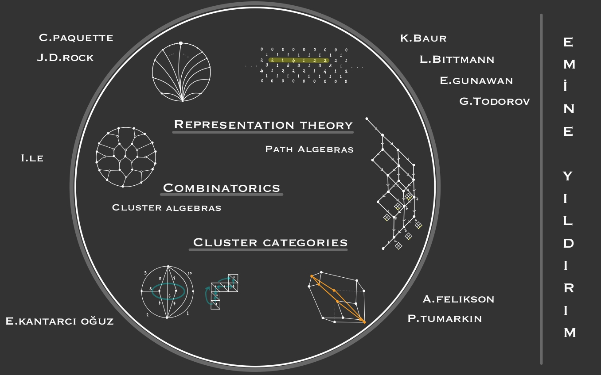

[[Home]](https://emine-yildirim.github.io/) 
[[Research]](https://emine-yildirim.github.io/Research.html) 
[[Teaching]](https://emine-yildirim.github.io/teaching.html)
[[Leeds Algebra Seminar]](https://emine-yildirim.github.io/Leeds_Seminars_2023-24.html)
[[Blog]](http://yildirimemine.tumblr.com/)

# Emine's Research Page

I am interested in representation theory of algebras, cluster algebras, their categorifications, and related combinatorics. Here is my [CV](Documents/EY_CV_2026.pdf). Below is a list of my papers and here is the link to the [ArXiv](https://arxiv.org/search/advanced?advanced=&terms-0-operator=AND&terms-0-term=Y%C4%B1ld%C4%B1r%C4%B1m%2C+Emine&terms-0-field=author&classification-mathematics=y&classification-physics_archives=all&classification-include_cross_list=include&date-filter_by=all_dates&date-year=&date-from_date=&date-to_date=&date-date_type=submitted_date&abstracts=show&size=50&order=-announced_date_first) versions.

1. [[arXiv:2605.04982]](https://arxiv.org/pdf/2605.04982) Esther Banaian, Wonwoo Kang, Elizabeth Kelley, Ezgi Kantarcı Oğuz and Emine Yıldırım, *Cluster Expansions from Punctured Orbifolds*, June 2026.

2. [[arXiv:2603.21157]](https://arxiv.org/pdf/2603.21157), Karin Baur, Anna Felikson, Deepanshu Prasad, Pavel Tumarkin and Emine Yıldırım, *Growth of infinite frieze patterns of affine type*, March 2026.

3. [[arXiv:2602.14802]](https://arxiv.org/pdf/2602.14802) Léa Bittmann, Perrine Jouteur, Ezgi Kantarcı Oğuz, Melody Molander and Emine Yıldırım, *A mirror deformation of Markov numbers*, February 2026.

4. [[arxiv:2511.19223]](https://arxiv.org/pdf/2511.19223) Federico Campanini, Francesca Fedele and Emine Yıldırım, *Lattices of Pretorsion Classes*, November 2025.

5. [[arXiv:2410.14656]](https://arxiv.org/pdf/2410.14656) Charles Paquette, Job Daisie Rock and Emine Yıldırım, *Categories of generalized thread quivers*, January 2025.

6. [[arXiv:2407.11232]](https://arxiv.org/pdf/2407.11232) Karin Baur, Léa Bittmann, Emily Gunawan, Gordana Todorov and Emine Yıldırım, *Infinite friezes of affine type D*, Combinatorial Theory 6 (2) (2026), #12.

7. [[arXiv:2402.14501]](https://arxiv.org/pdf/2402.14501.pdf) Ian Le and Emine Yıldırım, *Cluster Categorification of Rank 2 Webs*, v1 February 2024 and v2  February 2026. 


8. [[published]](https://alco.centre-mersenne.org/item/10.5802/alco.402.pdf) Anna Felikson, Pavel Tumarkin  and Emine Yıldırım, *Polytopal realizations of non-crystallographic associahedra*, Algebraic Combinatorics, Volume 8, issue 1 (2025), 17-28. [[arxiv]](https://arxiv.org/pdf/2401.08285)

9. [[published]](https://www.sciencedirect.com/science/article/pii/S0021869325000535) Ezgi Kantarcı Oğuz and Emine Yıldırım, *Cluster Expansions: T-walks, Labeled Posets and Matrix Calculations*, Journal of Algebra (2025), Vol. 669, pp. 183-219. [[arxiv]](https://arxiv.org/pdf/2211.08011)

10. [[published]](https://ems.press/journals/jca/articles/14298125) Rene Marczinzik, Hugh Thomas and Emine Yıldırım, *On the interaction of the Coxeter transformation and the Rowmotion bijection*, Journal of Combinatorial Algebra 8 (2024), 359–374. [[arxiv]](https://arxiv.org/pdf/2201.04446)

11. [[published]](https://londmathsoc.onlinelibrary.wiley.com/doi/10.1112/tlm3.12025)  Charles Paquette and Emine Yıldırım, *Completions Of Discrete Cluster Categories Of Type A*, Transactions of the London Mathematical Society (2021), 8(1), 35–64. https://doi.org/10.1112/tlm3.12025. [[arxiv]](https://arxiv.org/pdf/2006.07285)

12. [[published]](https://academic.oup.com/imrn/advance-article/doi/10.1093/imrn/rnaa110/5850126?login=true) Véronique Bazier-Matte, Guillaume Douville, Alexander Garver, Rebecca Patrias, Hugh Thomas and Emine Yıldırım, *Leading Terms of SL_3 Web Invariants*, International Mathematics Research Notices, (2020), rnaa110. https://doi.org/10.1093/imrn/rnaa110. [[arxiv]](https://arxiv.org/pdf/1903.10529)

13. [[published]](https://londmathsoc.onlinelibrary.wiley.com/doi/full/10.1112/jlms.12817)  Véronique Bazier-Matte, Nathan Chapelier-Laget, Guillaume Douville, Kaveh Mousavand, Hugh Thomas and Emine Yıldırım, *ABHY Associahedra and Newton Polytopes of F-polynomials for finite type cluster algebras*. Journal of the London Mathematical Society (2) (2024), 109 (1), Paper No. e12817, 27. https://doi.org/10.1112/jlms.12817. [[arxiv]](https://arxiv.org/pdf/1808.09986)

14. [[published]](https://link.springer.com/article/10.1007/s10468-018-9795-3)  Emine Yıldırım, *The Coxeter Transformation on Cominuscule Posets*. Algebra and Representation Theory, Vol. 22 (2019), No. 3, pp. 699-722. https://doi.org/10.1007/s10468-018-9795-3. [[arxiv]](https://arxiv.org/pdf/1710.10632)

15. [[published]](https://www.cambridge.org/core/journals/canadian-journal-of-mathematics/article/on-the-combinatorics-of-gentle-algebras/DAC0E0FF011FBAC0FD9E45F473AE2E99)  Thomas Brüstle, Guillaume Douville, Kaveh Mousavand, Hugh Thomas and Emine Yıldırım,  *On the combinatorics of gentle algebras*, Canadian Journal of Mathematics (2019), 1-30. https://doi:10.4153/S0008414X19000397. [[arxiv]](https://arxiv.org/pdf/1707.07665)

16.  [[published]](http://bims.iranjournals.ir/article_876.html) Tahire Özen and Emine Yıldırım, *X-Injective and X-Projective Complexes*. Bull. Iranian Math. Soc.Vol. 42 (2016), No. 5, pp. 1221-1235. [[arxiv]](https://arxiv.org/pdf/1303.0524)

### Other publications

1. Emine Yıldırım, *Pretorsion Theories*, Oberwolfach Report for [[Representation Theory of Quivers and Finite-Dimensional Algebras]](https://publications.mfo.de/handle/mfo/4440), 8-13 February 2026.

2. Emine Yıldırım, *Cluster Expansion via matrices*, Oberwolfach Report for [[Cluster Algebras and Its Applications]](https://publications.mfo.de/handle/mfo/4114), 14-19 January 2024.

3. Emine Yıldırım, *Webs and Gr(3,n)*, Oberwolfach Report for the [Arbeitsgemeinschaft: Cluster Algebras](https://publications.mfo.de/handle/mfo/4091), 8-13 October 2023.

4. Karin Baur and Emine Yıldırım, *Cluster Algebras*, Encyclopedia of Mathematical Physics 2nd edition, book title: Reference Module in Materials Science and Materials Engineering, 2023.

