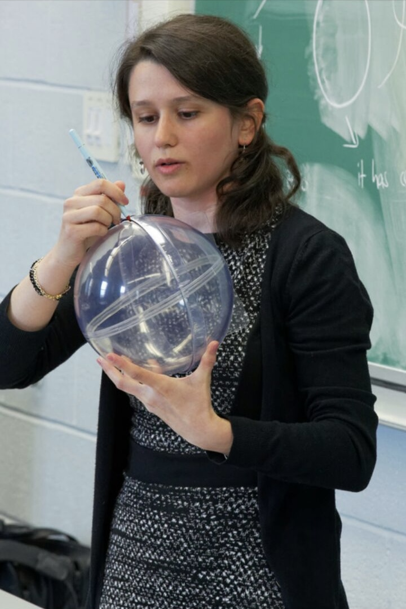

[[Home]](https://emine-yildirim.github.io/) 
[[Research]](https://emine-yildirim.github.io/Research.html) 
[[Teaching]](https://emine-yildirim.github.io/teaching.html)
[[Leeds Algebra Seminar]](https://emine-yildirim.github.io/Leeds_Seminars_2023-24.html)
[[Blog]](http://yildirimemine.tumblr.com/)

# Emine's Teaching Page

## University of Leeds, United Kingdom:

1. [**(Advanced) Commutative Rings and Algebraic Geometry**](https://emine-yildirim.github.io/teaching24), Winter 2024. *I was the module leader.*
2. **Project in Mathematics**, year 2022-2023. *I was a module co-leader.*

## Queen's University, Canada:

1. **Linear Algebra**, Winter 2020, 2021 (online). *Cotaught in 2020 and 2021, and I was the coordinator in 2021.*
2. **Rings and Fields**, Winter 2019. *Cotaught.*
3. **Vector Calculus**, Fall 2018, 2019, 2020 (online). *I was the only instructor, thus the coordinator, in all years.*
   
## University of New Brunswick, Canada:

Teaching assistant for introductory **calculus** classes, January 2014 - June 2015.

## Istanbul Arel University, Türkiye:

**Calculus I and II** between September 2012 - December 2013. *I was a full time lecturer.*

