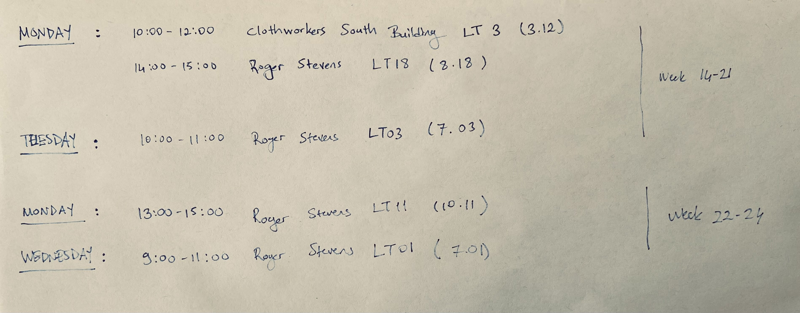

# MATH3195 Commutative Rings and Algebraic Geometry 
# MATH5195M Advanced Commutative Rings and Algebraic Geometry

Course Description in the University's module catalogue is [here](https://webprod3.leeds.ac.uk/catalogue/dynmodules.asp?Y=202324&m=MATH-3195).

[A quick survey](https://forms.office.com/Pages/ResponsePage.aspx?id=qO3qvR3IzkWGPlIypTW3y8VIs7uwudFLkLdOQJl7ItpURVpSQ0FHOEg0MlAwSkdMUEdNRkM5MldXVS4u)

[Lecture notes](Documents/Eleonore_Faber_Commutative_Rings.pdf) by [Eleonore Faber](http://www1.maths.leeds.ac.uk/~pmtemf/).

Exercise Sheets will be uploded below, or check the [Minerva page](https://minerva.leeds.ac.uk/ultra/courses/_552205_1/outline) for this course.

> [Exercise Sheet 1](Documents/ex1.pdf) due February 12. [Solutions](Documents/sol1.pdf)
> 
> [Exercise Sheet 2](Documents/ex2.pdf) due February 26. [Solutions](Documents/sol2.pdf)
>
> [Exercise Sheet 3](Documents/ex3.pdf) due March 11.
