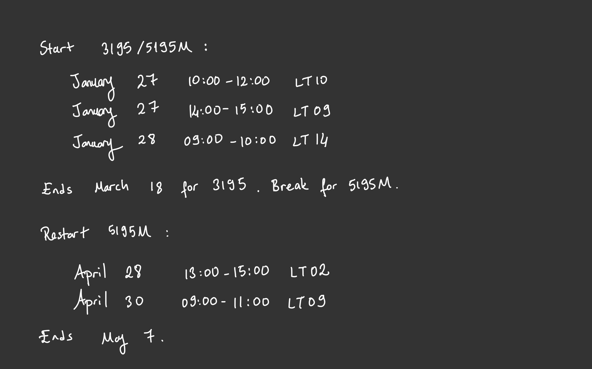

# MATH3195 Commutative Rings and Algebraic Geometry 
# MATH5195M Advanced Commutative Rings and Algebraic Geometry
# 2025

Course Description in the University's module catalogue is [here](https://webprod3.leeds.ac.uk/catalogue/dynmodules.asp?Y=202425&m=MATH-3195).

[Lecture notes](Documents/February_2025_3195_5195.pdf) by [Eleonore Faber](https://imsc.uni-graz.at/faber/index.html).

Exercise Sheets will be uploded below, or check out the course website on Minerva.

[Exercise Sheet 1](Documents/ex1_2025.pdf) due February 18.

